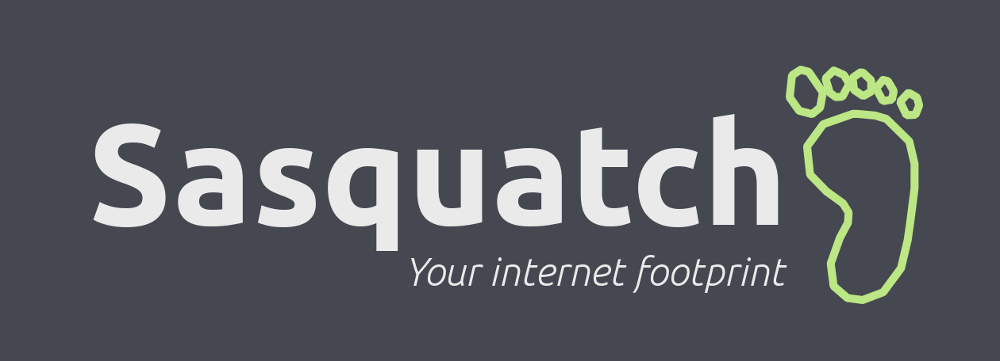

If you have a presence on the internet, you are probably active on a variety of services: Facebook, Twitter, Reddit, Discord, the list goes on. How do you manage a distributed identity like this? For us web developers, the answer seems obvious: just build yourself a website!

This solution is not within reach for everyone. The primary goal of **Sasquatch** is to make it easy for anyone to create their own **personal landing page** to manage their online identity. 

These landing pages are relatively simple: your name, a logo,a little text, and a list of links to places on the internet where you're active. The [website for this project](https://dwalkr.github.io/sasquatch/) is an example of what a Sasquatch page will look like.

## Creating Your Own Footprint

Creating your own landing page with Sasquatch will require a GitHub or a GitLab account. 

If you're reading this on GitHub and are here for the first time, *don't panic!* This is where some of us nerds like to store our code and talk about it. Go ahead and [sign up](https://github.com/join) for a GitHub account right now. I'll be here when you get back.

Once you have a GitHub or GitLab account, click the button below to create a copy of this repo and import it into the Forestry CMS. This step will also prompt you to create a Forestry account, but you can just sign up with your GitHub or GitLab account.

## Customizing Your Sasquatch Page

View the [customizer documentation](CUSTOMIZING.md)

## Hosting 

When you're ready to get your landing page up on the internet, you'll need to handle the hosting part yourself. **This is a lot easier than it sounds!** I recommend using [Netlify](https://www.netlify.com/) -- you can host your site **for free**, and set up is easy. This project is pre-configured to work seamlessly with Netlify. You can log in to their service with your GitHub account as well.

This project is also compatible with any other hosting option [recommended by Forestry](https://forestry.io/docs/hosting/).

## Claim Your Piece of the Web

In some ways, Sasquatch is an experiment. I hope you give it a shot, and ping me on here (or [@wordsaboutcode](https://twitter.com/wordsaboutcode) on Twitter) to let me know what you think!

## For the Nerds

Sasquatch sites are built with [Hugo](https://gohugo.io). All customizable options are stored in [data/pageOptions.toml](https://github.com/dwalkr/sasquatch/blob/master/data/pageOptions.toml), and this file is what is exposed in the Forestry UI to make the customizer work.

To run this site locally, you must have Hugo installed. I recommend the latest version of Hugo, but anything from `0.42` and up should be fine.

Start the local development server by running `hugo server`.

👣

